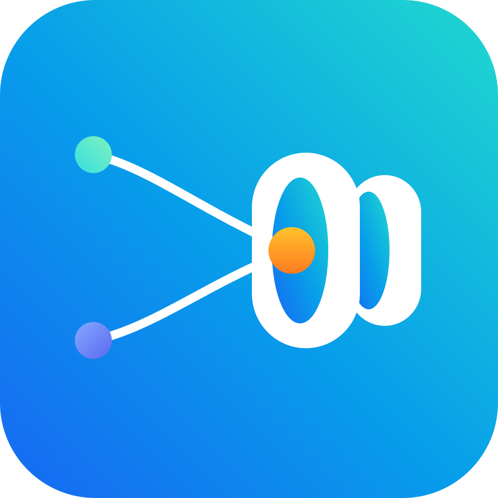

<p align="center">
  
</p>

<h1 align="center">AgentLens</h1>

<p align="center"><strong>本地 AI 编码 Agent 的观测与执行轨迹查看器。</strong></p>

<p align="center">
  <a href="README.md"><strong>简体中文</strong></a> ·
  <a href="README.en.md">English</a>
</p>

> **1.0 alpha：** AgentLens 1.0 是一次 Clean Rebuild，以 Canonical Observation + Evidence 为核心。0.x 只保留为实现参考和回归材料，不再进入 1.0 运行时。

## AgentLens 解决什么问题

不同 AI 编码工具的数据散落在 Hook、JSONL、SQLite、配置文件中。AgentLens 把这些**可观察数据**统一成一套有证据来源的执行模型，用来回答：

- 一次任务到底发生了什么；
- 这条事实来自哪个原生来源；
- Runtime Hook 和历史日志是不是同一件事；
- 哪些 Tool 真正调用过、哪些失败了；
- 哪些 Skill / MCP 已安装或配置，哪些又能够被可靠归因为“实际使用过”。

AgentLens 不负责执行 Agent，也不会声称可以读取模型未暴露的隐藏思维链。

## 1.0 已支持的 Source

| Source | History | Runtime | Assets |
| --- | --- | --- | --- |
| Codex | 原生 Session JSONL | Runtime Hook + Durable Inbox | Skill、MCP、Plugin、Hook、Rule |
| Claude Code | Project/Session JSONL | Runtime Hook + Durable Inbox | Skill、MCP、Plugin、Hook、Command |
| Pi | 原生 Session JSONL | 持续尾读原生 JSONL | Skill、Extension、MCP、Memory 类资产 |
| Hermes | 原生 SQLite 会话历史 | SQLite 原生尾读 + 可选 Runtime Hook | Skill、MCP、Plugin、Memory 等 |
| OpenCode | 原生会话/运行数据 | 原生运行数据增量采集 | 按 1.0 Source Contract 发现可识别资产 |
| DeepSeek Harness | Profile Session JSONL / JSONL.ZST，保留 Turn、Step、Tool、Usage、Request Header 与会话血统 | 监听发生变化的会话文件并按事件序号增量采集 | Profile Bundle、树外 Plugin、Profile 配置覆盖 |

DeepSeek Harness 的 `SessionHeader.cwd` 会映射为 AgentLens Workspace；`parentSessionId` 会作为原生父会话事实进入 `SourceSession.nativeParentSessionId`。AgentLens 保留这条血统，但不会仅凭“存在父会话”就把关系强行判定为子智能体。

DSH Profile 的 Bundle / Plugin 发现依据 Profile 自身 `package.json` 的 `dsh.profile.bundles` 与依赖声明；`cordis.patch.yml` 作为 Profile 配置覆盖记录。当前不会展开压缩 reasoning chunk，也不会在缺乏可靠事实时推断隐藏思维、权限事件或资产调用归因。

## 快速开始

要求 Node.js **22.23+**。

### npm 安装

```bash
npm install -g @z7ping/agent-lens

agent-lens setup
```

`agent-lens setup` 会完成一次性初始化：检查 Node.js 与数据目录，识别本机可用 Source，并只为需要 Hook 的来源补齐 AgentLens 自己的 Hook。原生 History / Runtime Tail 来源不会为了接入 AgentLens 强行修改第三方工具配置。

初始化完成后可以选择前台或后台运行：

```bash
# 前台运行，适合调试
agent-lens start

# 后台常驻，适合长期使用
agent-lens service start

# 可选：登录系统后自动运行
agent-lens autostart enable
```

查看状态：

```bash
agent-lens status
agent-lens service status
agent-lens autostart status
agent-lens doctor
```

`setup` 只负责初始化，不会自动替用户开启后台常驻或登录自启。`service` 负责“现在是否后台运行”，`autostart` 只负责“下次登录是否自动启动”，两者互相独立。

npm 后台生命周期直接使用操作系统原生的用户级托管能力：

- Windows：当前用户计划任务；
- Linux：`systemd --user`；
- macOS：用户级 `launchd`。

AgentLens 不恢复 0.x 的 PID / Service Manager 架构，也不会因为后台方式不同创建第二套 Runtime 或数据库。

打开：

```text
http://127.0.0.1:56789/
```

`agent-lens start` 设计为前台运行；启动前会先探测已有 AgentLens Daemon，兼容时直接复用，不启动第二套。npm 与 Windows Desktop 可以同时安装，但共享同一个默认数据根与默认运行时。

### 源码运行

```bash
npm install
npm run typecheck
npm test
npm run build:web
npm run dev
```

源码环境使用 CLI：

```bash
npm run cli -- setup
npm run cli -- doctor
npm run cli -- start
```

需要测试 `service` / `autostart` 时，先生成正式发行入口，避免把临时 `tsx` 开发命令注册进系统启动项：

```bash
npm run build:dist
npm run cli -- service status
npm run cli -- autostart status
```

## Windows 桌面版

Windows Release Workflow 会生成 x64 NSIS 安装包：

```text
AgentLens-<version>-Setup-x64.exe
```

### 本地构建 Windows 安装包

要求：

- Windows x64；
- Node.js **>= 22.23.0**；
- PowerShell 7（`pwsh`）；
- 已安装 npm 依赖。

在仓库根目录执行：

```powershell
node -v
npm install
npm run desktop:win
```

`npm run desktop:win` 会依次执行：

```text
Web 表现层收敛检查
-> Electron 主进程语法检查
-> 构建正式 dist
-> 准备桌面运行时
-> electron-builder
-> NSIS x64 安装包
```

生成的安装包位于：

```text
release/windows/
```

例如当前版本会生成类似：

```text
AgentLens-1.0.0-alpha.0-Setup-x64.exe
```

NSIS 安装器允许选择安装目录，并创建桌面快捷方式和开始菜单快捷方式。卸载 AgentLens 不会自动删除用户观测数据。

### 使用 GitHub Actions 构建

也可以不在本机准备 Windows 打包环境，直接在 GitHub 仓库中手动执行：

```text
Actions
-> Windows Installer
-> Run workflow
```

工作流会在 `windows-latest` 上完成依赖安装、表现层检查、桌面主进程检查、类型检查、测试和安装包构建，并上传：

```text
AgentLens-<version>-Setup-x64.exe
SHA256SUMS.txt
```

手动执行时可以从该次 Actions 运行的 Artifacts 下载；正式发布 GitHub Release 时，安装包和校验文件会自动附加到 Release。

### Windows 代码签名

开发版和 alpha 阶段没有代码签名证书也可以正常构建安装包，但 Windows 可能显示“未知发布者”或 SmartScreen 提示。

正式发布时可在 GitHub Secrets 中配置：

```text
WINDOWS_CSC_LINK
WINDOWS_CSC_KEY_PASSWORD
```

Windows Installer 工作流已经预留这两个签名变量，不需要为了签名再维护另一套打包流程。

Electron 只承担桌面壳职责：

- 单实例；
- BrowserWindow；
- 系统托盘；
- 启动 / 复用 / 停止自己拥有的 Daemon；
- Windows 登录后自动运行；
- 日志和数据目录入口。

桌面端启动时先检查 `127.0.0.1:56789`：已有兼容 npm / service Daemon 时直接复用；只有没有兼容运行时时才创建自己的 Daemon。退出桌面应用时不会误杀外部方式管理的 Daemon。

AgentLens Core、Source、SQLite、HTTP/SSE 不搬进 Electron 私有实现中，桌面版和 CLI/npm 版仍然使用同一个 Daemon。

卸载桌面应用不会自动删除 `~/.agent-lens/1.0` 中的观测数据。

## Web 1.0

Web 本身是独立的 Cordis Surface Plugin：`@agent-lens/web`。它通过 `ctx.http.mountStatic()` 挂载 React SPA；不开 Web 时 HTTP/API 仍可独立运行。Web 只消费 `@agent-lens/protocol` DTO，不直接依赖 Core、SQLite 或 Source 实现。

当前技术栈：React 19 + Vite + Tailwind CSS。业务状态放在 React 外的 `AgentLensClientModel` 中，React 通过 `useSyncExternalStore` 订阅，因此实时数据流不依赖组件级状态拼接。

界面采用两级顶部结构：一级是产品导航，二级是 Agent 快捷入口与当前页面筛选。Agent 快捷入口会根据本机扫描结果自动初始化，用户也可以自行 Pin 常用 Agent；是否 Pin 只影响界面展示，不控制 Source 是否启用。

### 任务复盘

采用 `Session List | Session Detail` 左右布局，以 Session / Interaction 为主要阅读结构：

- 用户与 Agent 消息以对话形式展示；
- 连续 Tool Call 归为执行过程，可展开查看结果、错误与耗时；
- Permission、Subagent、Context、Model 等生命周期事件穿插在真实执行流中；
- Codex、Claude Code、Pi、Hermes、OpenCode、DeepSeek Harness 保留各自有意义的原生事实；
- Pi 与 DeepSeek Harness 可保留原生 parent/session relationship；
- Evidence 与 Raw Payload 放在临时 Inspector 中，默认不打断主阅读流。

支持按 Agent、项目、时间、错误状态和关键字筛选，不再要求用户手工输入 installationId / logicalSessionId。

### 工具分析

基于 Canonical Observation 统计真实 Tool 使用情况，包括调用次数、涉及 Session、成功/失败、总耗时与平均耗时，并支持 Agent、项目和时间范围筛选。

当前优先展示可证实事实；0.x 中的价值分、风险分、工作流候选等启发式分析不会未经重新设计直接搬回 1.0。

### Agent 概览

展示本机 Agent 的：

- 检测状态与 Installation 信息；
- Source 声明的可观测 Capability；
- 静态扫描得到的 Skill / MCP / Plugin / Extension / Hook 等能力资产；
- Asset Binding 路径、版本及 installed/configured/enabled/discoverable 等状态；
- 能够由 Evidence 可靠归因的 Skill / MCP 实际使用记录。

“装了 / 配了”和“真正用过”在模型与界面中保持分离。

### 实时更新

Web 使用 SSE 接收 Observation、Source Detection 与 Asset 变化。SSE 会在首屏 Snapshot 请求前建立，避免启动扫描期间出现 API → SSE 的事件盲区。

`AgentLensClientModel` 对高频事件做短窗口合批：任务复盘、工具统计和 Agent 资产分别按各自节奏更新；React 只消费稳定 Snapshot，不通过整页 DOM 替换制造“自动刷新页面”的体验。页面退出时主动关闭 SSE。

## CLI

```text
agent-lens setup [--json]
agent-lens start
agent-lens status [--json]
agent-lens doctor [--json]
agent-lens service start|stop|restart|status [--json]
agent-lens autostart enable|disable|status [--json]
agent-lens hook status [codex|claude|all] [--json]
agent-lens hook install [codex|claude|all]
agent-lens hook uninstall [codex|claude|all]
```

`setup` 是推荐的首次初始化入口。Hook 安装是幂等的，只修改 AgentLens 自己的 handler；同一个 Hook group 中的第三方 handler 会被保留。Codex trust hash 也只维护 AgentLens 对应条目。

后台生命周期由操作系统原生用户级托管器负责，AgentLens 自身不维护 PID 文件。`service restart` 也不会强行接管由 Windows 客户端或前台 CLI 所有的现有运行时。

## 一张图理解 1.0

```text
Native Source
  -> SourceRecord
  -> SourceDefinition.normalize()
  -> ObservationCandidate + EvidenceCandidate
  -> IdentityService
  -> ObservationService.commit()
  -> CanonicalObservation + Evidence
  -> SQLite repositories
  -> Projections
  -> @agent-lens/protocol
  -> HTTP / SSE
  -> @agent-lens/web / Desktop
```

Cordis 是唯一 Plugin Runtime，固定依赖 `@deepseek-ai/cordis@4.0.1`。AgentLens Core 保持框架无关；Source / Storage / Surface 等运行时扩展入口直接采用 Cordis-native Plugin，`packages/runtime-cordis` 负责共享 Context typing、元数据和兼容性测试，不再额外包一层通用 AgentLens Plugin Runtime。

详细文档：

- [1.0 架构](ARCHITECTURE.md)
- [Core Contract](docs/1.0/CORE-CONTRACT.md)
- [ADR-0001：Clean Rebuild 与 Cordis Runtime](docs/adr/0001-agentlens-1.0-clean-rebuild-and-cordis-runtime.md)
- [ADR-0002：Web Plugin 与 Client State Model](docs/adr/0002-web-plugin-and-client-state-model.md)
- [ADR-0004：双发行、单运行时与生命周期所有权](docs/adr/0004-dual-distribution-single-runtime-lifecycle.md)

## Evidence 是一等公民

Canonical Observation 表达“AgentLens 认为发生了什么”，Evidence 表达“为什么这么认为”。

例如：

```text
runtime-hook + observed
native-log  + reported
static-scan + observed
```

同一个 Tool Call 如果既被 Runtime Hook 看见、又出现在历史 JSONL 中，正确结果应该是：

```text
1 个 Canonical tool.call
+ 2 条 Evidence
```

而不是两条重复事实。

## “装了”不等于“用过”

静态扫描只能证明 Skill/MCP/Plugin/Hook 已安装、已配置或可发现，不能证明实际调用。

当前 Asset Usage 只在可以可靠归因时生成，例如：

- `mcp__server__tool` -> MCP server；
- Claude `Skill` Tool 明确传入 skill 名称 -> Skill usage。

普通 Bash / Read / Write 不会因为机器上装了某个 Skill 就被强行归进去。

## 本地数据

默认数据目录：

```text
~/.agent-lens/1.0/
├── agent-lens.db
└── inbox/
    ├── codex/
    └── claude/
```

HTTP 只监听 `127.0.0.1`，默认端口 `56789`。

Runtime Hook 进程只负责轻量脱敏和原子写 Durable Inbox；真正的 Canonical Persist 由 Daemon 完成。

## 开发命令

```bash
npm install
npm run typecheck
npm test
npm run build:dist
npm pack --dry-run
npm run desktop:win        # Windows runner
```

目录：

```text
apps/
  cli/ daemon/ desktop/ hook-codex/ hook-claude/
packages/
  core/ core-services/ runtime-cordis/ protocol/
  storage-sqlite/
  source-codex/ source-claude/ source-pi/ source-hermes/ source-opencode/
  projection-timeline/ projection-session/ projection-usage/
  projection-review/ projection-overview/
  surface-http/ web/ hook-manager/
```

DeepSeek Harness Source 当前先内聚在 `apps/daemon/src/sources/dsh.ts`，待行为与锁文件变更一起收稳后再提取为独立 `packages/source-dsh`，不会为了目录形式复制第二套实现。

## 发布流程

创建 GitHub Release 后：

1. Linux + Windows 验证；
2. typecheck / tests / distribution build；
3. 打出唯一 npm tarball；
4. 生成 SBOM 和 SHA-256；
5. 上传 GitHub Release artifacts；
6. 发布**同一个 tarball**到 npm；
7. Windows Workflow 构建并上传 NSIS Installer。

Release tag 必须与 `package.json` version 一致，允许 `v` 前缀。

## License

MIT
